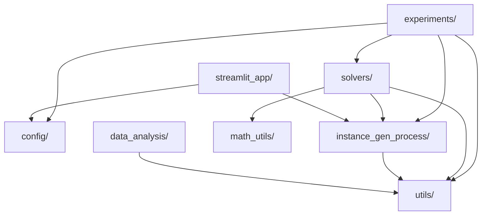
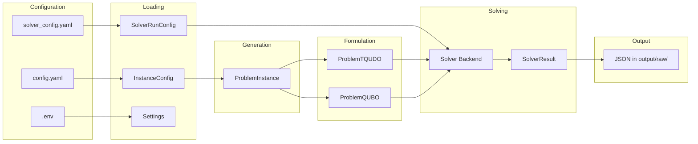

# Architecture

Comprehensive technical reference for the Hotels-TSP-Tensor-QUDO project.

Reference paper: [Introduction to QUDO, Tensor QUDO and HOBO formulations](https://arxiv.org/abs/2508.01958) (arXiv:2508.01958).
Cost equations: [formulations.md](formulations.md).

---

## Problem statement

Given N cities (including a fixed depot), find the route through all non-depot
cities that minimises total cost. Costs have two components:

- **Hotel cost** -- staying in city `a` at timestep `t`: `prices_hotels[t, a]`.
- **Travel cost** -- moving from city `a` to city `b` at timestep `t`: `prices_travels[t, a, b]`.

The route starts and ends at the depot (city `N-1`). Each city is visited
exactly once. A set of **precedence constraints** `P = {(i, j)}` requires that
city `i` appears before city `j` in the route.

The decision variable is a sequence `x = (x_0, x_1, ..., x_{N-2})` where
`x_t` is the city index visited at timestep `t`, drawn from `{0, 1, ..., N-2}`.
`n_available = N - 1` is the number of non-depot cities.

---

## Module map

```
src/
├── config/                  Runtime settings from .env
├── instance_gen_process/    Config loading, models, instance + formulation generation
├── math_utils/              QUBO-to-Ising conversion
├── solvers/
│   ├── base.py              SolverProtocol, SolverRunConfig, SolverResult
│   ├── _qaoa_base.py        Shared QAOA solver logic (Cirq + CUDA-Q)
│   ├── noise.py             Backend-agnostic NoiseConfig
│   ├── cirq_solver/         Cirq backend (native qudits + qubit emulation + QUBO)
│   ├── cudaq_solver/        CUDA-Q backend (qubit emulation + QUBO)
│   ├── simulated_annealing/ Classical SA backend
│   └── brute_force/         Exact enumeration (full QUBO / TQUDO assignment space)
├── experiments/             Experiment workflow (generate, solve, save)
├── data_analysis/           Ingest raw JSON → manifest, paired metrics, plots
├── streamlit_app/           Streamlit UI shell
└── utils/                   Costs, constraints, QAOA helpers, progress, output paths
```

### Module dependency graph



---

## Data flow

The full experiment lifecycle from configuration to saved results:



### Step-by-step

1. `load_instance_config()` parses `config.yaml` into an `InstanceConfig`.
2. `load_solver_config()` parses `solver_config.yaml` into a dict, which
   `solver_config_to_run_config()` converts to a `SolverRunConfig`.
3. `load_settings()` reads `.env` into a `Settings` object (backend choice,
   noise kill-switch, paths, seed).
4. `generate_random_set_instances(config, n_instances, seed)` produces a list
   of `ProblemInstance` objects, each with a unique reproducible seed.
5. `validate_solver_instance_compatibility()` checks formulation-backend
   compatibility and qubit count limits.
6. For each instance, the solver's `solve()` method:
   - Calls `generate_TQUDO_from_problem()` or `generate_QUBO_from_problem()`
     internally to build the formulation-specific representation.
   - Runs the optimisation (QAOA, SA, or brute-force enumeration).
   - Returns a `SolverResult` with objective value, feasibility flag, runtime,
     and metadata (best sequence, energy history, optimal angles, samples).
7. Results are saved incrementally as JSON files in `output/raw/`, one per
   instance, with the naming pattern
   `exp_{timestamp}_inst_{i}_{solver}_{formulation}.json`.

---

## Two formulations

The same Hotel TSP problem is encoded in two different mathematical forms. Full
equations are in [formulations.md](formulations.md).

### Tensor-QUDO (`ProblemTQUDO`)

- **Variables**: d-dimensional qudits where `d = n_available`. Each qudit
  takes a value in `{0, ..., d-1}`, directly representing a city index.
- **Tensors**:
  - `Etab[t, a, b]` (3D, shape `d x d x d`) -- encodes travel costs,
    hotel costs, and closed-loop legs (depot to first, last to depot).
  - `Ettprimeab[t, t', a, b]` (4D, shape `d x d x d x d`)
    -- encodes `lambda_1` (no duplicate cities) and `lambda_2` (precedence
    violations) penalties.
- **No lambda_0 needed**: the qudit encoding inherently enforces exactly one
  city per timestep (a qudit can only hold one value).
- **Normalisation**: both tensors are divided by
  `energy_scale = max(|Etab|, |Ettprimeab|, 1.0)` so all values lie in
  `[-1, 1]`. Sampled costs are multiplied by `energy_scale` to recover
  original units.
- **Cost**: `C(x) = sum_t Etab[t, x_t, x_{t+1}] + sum_{t < t'} Ettprimeab[t, t', x_t, x_{t'}]`
- For feasible solutions, `C(x) = real_cost` (no offset).

### QUBO (`ProblemQUBO`)

- **Variables**: binary one-hot encoding `x_{t,i} in {0, 1}` where
  `x_{t,i} = 1` means city `i` is visited at timestep `t`.
  Total variables: `n_vars = n_available^2`.
- **Matrix**: `qubo_matrix` (2D, shape `n_vars x n_vars`) -- symmetric,
  normalised so all entries lie in `[-1, 1]`.
- **All three penalties needed**:
  - `lambda_0`: exactly one city per timestep (one-hot row constraint).
  - `lambda_1`: exactly one timestep per city (one-hot column constraint).
  - `lambda_2`: precedence constraint violations.
- **Cost**: `C(x) = x^T Q x * energy_scale`
- **Offset**: for feasible solutions,
  `QUBO_cost = real_cost - (lambda_0 + lambda_1) * n_available`.
  Use `calculate_real_cost()` for formulation-independent comparisons.

### Linear indexing for QUBO

The flattened binary vector uses row-major ordering:
`idx(t, i) = t * n_available + i`.

---

## Solver backends

All solvers implement the `SolverProtocol`:

```python
class SolverProtocol(Protocol):
    solver_name: str
    def solve(self, instance: ProblemInstance, run_config: SolverRunConfig) -> SolverResult: ...
```

### Formulation-backend compatibility matrix

| Formulation      | Cirq | CUDA-Q | Simulated Annealing | Brute force |
|------------------|:----:|:------:|:-------------------:|:-----------:|
| `tqudo`          |  Y   |   --   |         Y           |      Y      |
| `tqudo_virtual`  |  Y   |   Y    |         --          |     --      |
| `qubo`           |  Y   |   Y    |         Y           |      Y      |

- `tqudo`: native d-dimensional qudits. Only Cirq supports real qudit gates.
- `tqudo_virtual`: qubit emulation of qudits. Requires `n_available` to be a
  power of two (each qudit is encoded in `ceil(log2(d))` qubits).
- `qubo`: standard binary QUBO. Available on all backends.

### BaseQAOASolver

Cirq and CUDA-Q share a common base class `BaseQAOASolver` that handles:

- Formulation dispatch (`tqudo` / `tqudo_virtual` / `qubo`).
- Generating the formulation object from `ProblemInstance` + `RestrictionConfig`.
- Calling the appropriate `run_qaoa()` function.
- Validating feasibility and computing `real_cost` for feasible solutions.
- Building standardized metadata (best sequence, energy history, optimal angles,
  initial/final samples).

Subclasses override three methods to provide backend-specific QAOA runners:

- `_get_tqudo_runner()` -- native qudit QAOA (returns `None` if unsupported).
- `_get_tqudo_virtual_runner()` -- qubit-emulated TQUDO QAOA.
- `_get_qubo_runner()` -- QUBO QAOA.

---

## QAOA circuit architecture

All QAOA implementations follow the same high-level structure:

1. **Initial state**: uniform superposition (Hadamard or qudit DFT).
2. **Cost layer**: encode problem Hamiltonian as parametrized phase gates (gamma).
3. **Mixer layer**: apply mixing unitaries (beta).
4. **Repeat** cost + mixer for `qaoa_depth` layers.
5. **Measure** and decode the best solution.
6. **Optimise** gamma/beta parameters via `scipy.optimize.minimize`.

Initial parameters use TQA (Trotterized Quantum Annealing) scheduling:
`gamma_i = (i/p) * delta_t`, `beta_i = (1 - i/p) * delta_t`.

### Cirq QUBO

Module: `solvers/cirq_solver/qaoa_circuit_qubo.py`

1. `qubo_to_ising(Q)` converts Q matrix to Ising `(h, J, offset)`.
2. Cost layer: `cirq.rz(2 * gamma * h[i])` per qubit + `cirq.ZZ` exponentiation
   for coupling terms `J[i,j]`.
3. Mixer: `cirq.rx(2 * beta)` on each qubit.
4. Sampling via `cirq.Simulator` (or `DensityMatrixSimulator` with noise).
5. Cost evaluation averages `x^T Q x` over all samples.

### Cirq TQUDO native

Module: `solvers/cirq_solver/qaoa_circuit_tqudo.py`

Uses three custom d-dimensional gates on `cirq.LineQid(dimension=d)`:

- **QuditHadamardGate**: d-dimensional DFT matrix creating uniform superposition
  `|+_d> = (1/sqrt(d)) sum_k |k>`.
- **QuditDiagonalCostGate**: diagonal d^2 x d^2 two-qudit gate encoding
  `exp(-i * gamma * E[x0, x1])` for each basis pair. Replaces O(d^2)
  multi-controlled gates with a single operation per qudit pair.
- **QuditRingMixerGate**: `exp(-i * beta * (X_d + X_d^dag)/2)` where `X_d`
  is the cyclic-shift operator. For d=2, this reduces to Rx(2*beta).

Measurement returns integer values `0..d-1` per qudit directly.

### Cirq TQUDO virtual (qubit emulation)

Module: `solvers/cirq_solver/qaoa_circuit_tqudo_qubit_emulation.py`

- Requires `n_available` to be a power of two.
- Each qudit is encoded in `ceil(log2(d))` qubits.
- Cost layer: multi-controlled phase gates with X-flip pre/post conditioning
  to target specific computational basis states.
- Mixer: standard `rx(2 * beta)` on each qubit.
- Measurement requires `bitstring_to_qudit_sequence()` decoding.

### CUDA-Q QUBO

Module: `solvers/cudaq_solver/qaoa_circuit_qubo.py`

1. `ising_to_spin_op(h, J)` builds `cudaq.SpinOperator`.
2. Cost layer: `rz(2 * gamma * h[i])` + CNOT-Rz-CNOT decomposition for
   ZZ coupling.
3. Mixer: `rx(2 * beta)` on each qubit.
4. Sampling via `cudaq.sample()`.

### CUDA-Q TQUDO virtual

Module: `solvers/cudaq_solver/qaoa_circuit_tqudo.py`

Same multi-controlled phase approach as Cirq virtual, but using CUDA-Q
kernel API. Requires power-of-two qudit dimension.

### Simulated Annealing

Module: `solvers/simulated_annealing/solver.py`

No quantum circuit -- operates directly on permutation sequences.

- Supports `tqudo` and `qubo` formulations (not `tqudo_virtual`).
- **Neighbourhood operators** (chosen randomly each step):
  - `_swap_neighbor`: swap two random elements.
  - `_insert_neighbor`: remove and reinsert a random element.
  - `_reverse_neighbor`: 2-opt reverse of a random segment.
- **Cooling**: geometric schedule `T *= alpha`, from `sa_t_initial` to
  `sa_t_final`.
- Acceptance: Metropolis criterion `exp(-delta_E / T)`.
- Metadata includes `iterations_completed` and `final_temperature`.

### Brute force

Module: `solvers/brute_force/solver.py`

Exact baseline: enumerates **every** assignment in the active formulation space
(`qubo`: all `2^(n_available²)` bitstrings; `tqudo`: all `n_available^n_available`
integer sequences). Not supported: `tqudo_virtual`. Hard caps are enforced in
`solvers/brute_force/limits.py` (`n_available ≤ 8` for TQUDO, `(n_available²) ≤ 30`
binary variables for QUBO). Optional YAML caps:
`brute_force_max_assignments_tqudo` / `brute_force_max_assignments_qubo`.

---

## Noise simulation

### NoiseConfig

Backend-agnostic configuration consumed by both Cirq and CUDA-Q:

| Field         | Type                | Default          | Description                                     |
|---------------|---------------------|------------------|-------------------------------------------------|
| `enabled`     | `bool`              | `False`          | Master switch                                   |
| `noise_type`  | `NoiseModelType`    | `"depolarizing"` | Channel type                                    |
| `probability` | `float`             | `0.01`           | Error probability in [0, 1]                     |
| `gate_noise`  | `dict[str, float]`  | `{}`             | Per-gate probability overrides (e.g. `"rx": 0.02`) |

Supported noise types: `depolarizing`, `amplitude_damping`, `phase_damping`,
`bit_flip`, `phase_flip`.

### Backend noise behaviour

| Scenario                        | Cirq qubits                     | Cirq native qudits (d > 2)          | CUDA-Q                       |
|---------------------------------|---------------------------------|--------------------------------------|------------------------------|
| Single-qubit/qudit gates        | Channel applied per qubit       | d-dimensional channel per qudit      | Channel applied per qubit    |
| Two-qubit/qudit gates (depol.)  | Correlated depolarizing         | Correlated d^2-dim depolarizing      | Two-qubit depolarizing       |
| Two-qubit gates (non-depol.)    | Independent per qubit           | Correlated depolarizing (always)     | No noise on two-qubit gates  |

For exact cross-backend comparability, use `"depolarizing"`.

### Simulator selection

- **Cirq**: noiseless uses `cirq.Simulator`; noisy uses
  `cirq.DensityMatrixSimulator`.
- **CUDA-Q**: `ensure_cudaq_target()` selects `nvidia` (fp64 GPU) when no
  noise. With noise, it probes for GPU trajectory support; if unavailable,
  falls back to `density-matrix-cpu`.

### Environment kill-switch

`HTSP_ENABLE_NOISE_SIMULATION=false` in `.env` overrides `noise.enabled: true`
in `solver_config.yaml`, forcing noise off regardless of YAML config.

### Memory scaling warnings

`warn_if_large_system()` logs warnings when effective qubit count exceeds 15:

- Density-matrix: O(4^n) memory.
- GPU trajectory: O(2^n) memory.
- Qudits: O(d^{2n}) memory (equivalent qubits = n * log2(d)).

---

## Cost function pipeline

Three cost functions serve different purposes:

| Function               | Input               | Returns                          | Use case                                |
|------------------------|---------------------|----------------------------------|-----------------------------------------|
| `calculate_qubo_cost`  | `ProblemQUBO`, binary vec | `x^T Q x * energy_scale`   | QUBO objective (includes penalty offset) |
| `calculate_tqudo_cost` | `ProblemTQUDO`, qudit seq | `(Etab + Ettprimeab) * energy_scale` | TQUDO objective                  |
| `calculate_real_cost`  | `ProblemInstance`, city seq | `hotel_cost + travel_cost`  | Formulation-independent real cost      |

For feasible solutions:

- `tqudo_cost == real_cost` (no offset).
- `qubo_cost == real_cost - (lambda_0 + lambda_1) * n_available`.

Always use `calculate_real_cost()` when comparing solutions across formulations.

---

## Constraint validation

| Function                             | Checks                                                        |
|--------------------------------------|---------------------------------------------------------------|
| `validate_instance_constraints`      | Array shapes, precedence bounds, acyclicity                   |
| `validate_solution_constraints_tqudo`| Length, no duplicates, valid indices, precedence order         |
| `validate_solution_constraints_qubo` | Decodes binary to sequence, then checks precedence and uniqueness |
| `would_create_cycle`                 | BFS reachability check before adding a precedence edge        |

### Encoding conversions

- `qubo_binary_to_sequence(binary, n_available)` -- one-hot binary vector to
  city sequence. Returns `None` if invalid encoding.
- `sequence_to_qubo_binary(sequence, n_available)` -- city sequence to one-hot
  binary vector.

---

## Output structure

```
output/
├── raw/           Per-instance JSON (workflow); solutions under raw/solutions/<solver>/...
├── processed/     data_analysis: manifest, paired_metrics, summary_by_config, optional curves
└── images/        data_analysis: feasibility, ratios, energy curves (*.png)
```

Each JSON file in `output/raw/` contains:

```json
{
  "instance": { "n_cities": ..., "precedences": ..., "prices_hotels": ..., "prices_travels": ... },
  "instance_config": { "n_cities": ..., "n_precedences_range": ..., ... },
  "instance_index": 0,
  "solver_config": { "solver": ..., "formulation": ..., "restriction": ..., ... },
  "solver_output": {
    "solver_name": "...",
    "objective_value": ...,
    "feasible": true,
    "runtime_seconds": ...,
    "metadata": {
      "best_sequence": [...],
      "real_cost": ...,
      "initial_energy": ...,
      "energy_history": [...],
      "optimal_angles": { "gamma": [...], "beta": [...] },
      "initial_samples": { "bitstring": count, ... },
      "final_samples": { "bitstring": count, ... }
    }
  }
}
```

---

## Experiment workflow

The `run_workflow()` function in `experiments/main_experiment_workflow.py`
orchestrates the full pipeline:

1. Load instance and solver configs.
2. Validate formulation-backend compatibility.
3. Generate `n_instances` random problem instances.
4. Apply environment noise kill-switch if needed.
5. Solve each instance, saving JSON results incrementally.
6. Handle SIGINT gracefully (finish current instance, then stop).
7. Log warnings for failed instances.

CLI entry point: `python -m experiments.main_experiment_workflow`

Options: `--instance-config`, `--solver-config`, `--output`, `--mode` (see
[development.md](development.md)).

### Post-processing

After JSON exists under `output/raw/`, run `python -m data_analysis.pipeline`
(or `make analysis-all` with the `analysis` extra installed) to populate
`output/processed/` and `output/images/`.

---

## Streamlit UI

`streamlit_app/` is a minimal shell displaying settings and config as JSON;
extend as needed for interactive experiments.
