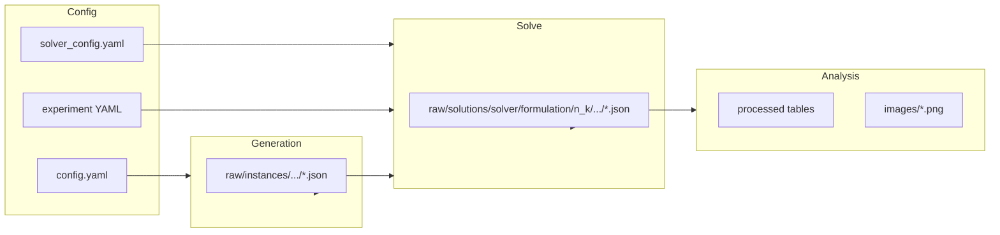

# Repository guide

Narrative overview of how this project is organized and how data moves through it. For module-level detail and diagrams, see [architecture.md](architecture.md).

---

## What problem this solves

A **Hotel TSP** variant: choose an order to visit all non-depot cities once each, minimizing hotel plus travel costs over timesteps, with **precedence constraints** (city *i* before city *j*). Two encodings are implemented:

- **Tensor-QUDO** (`tqudo` / `tqudo_virtual`): qudit or emulated-qubit layout; see [formulations.md](formulations.md).
- **QUBO**: binary one-hot with penalty weights \(\lambda_0,\lambda_1,\lambda_2\).

Solvers (Cirq, CUDA-Q, simulated annealing, brute force) all expose the same logical contract: load a `ProblemInstance`, return a `SolverResult`. See [solvers/base.py](../src/solvers/base.py).

---

## Layout under `src/`

| Area | Role |
|------|------|
| `instance_gen_process/` | YAML configs, dataclasses (`ProblemInstance`, `ProblemTQUDO`, `ProblemQUBO`), generators |
| `solvers/` | `SolverProtocol`, shared QAOA logic (`_qaoa_base.py`), backends (`cirq_solver/`, `cudaq_solver/`, `simulated_annealing/`, `brute_force/`), noise config |
| `experiments/` | CLI workflow: generate instances, batch solves, parallel workers (`parallel_solve_batch.py`) |
| `utils/` | Costs (scalar + [costs_batch.py](../src/utils/costs_batch.py)), constraints, JSON/YAML, experiment paths, progress |
| `data_analysis/` | Ingest solution JSON → tables → figures |
| `config/` | `Settings` from `.env` (`HTSP_*`) |
| `streamlit_app/` | Optional UI |

---

## End-to-end flow

1. **Configure** instance generation (`src/instance_gen_process/config.yaml` or overrides) and solver defaults (`solver_config.yaml`). Experiment YAMLs under `src/experiments/` merge with `solver_config.yaml` for each run.
2. **Generate** disk instances with `--mode generate` → JSON under `output/raw/instances/n_<n_cities>/instance_<k>.json` (or your `HTSP_OUTPUT_DIR`).
3. **Solve** with `--mode cudaq`, `sa`, `cirq5`, `brute_force`, or `experiment` → one JSON per instance under `output/raw/solutions/<solver>/<formulation>/n_<n>/[depth/]instance_<k>.json`.
4. **Analyze** with `data_analysis` → `output/processed/*` and `output/images/*.png`; optional static site in `webpage_results/` served over HTTP.

Path helpers live in [utils/experiment_paths.py](../src/utils/experiment_paths.py) and [utils/output_paths.py](../src/utils/output_paths.py).

---

## Related docs

- [parallelism_and_vectorization.md](parallelism_and_vectorization.md) — speedups across instances vs vectorized cost evaluation.
- [experiments_design_and_artifacts.md](experiments_design_and_artifacts.md) — workflow modes and what each solution file stores.
- [reproducing_results_from_scratch.md](reproducing_results_from_scratch.md) — command checklist from a clean clone.
